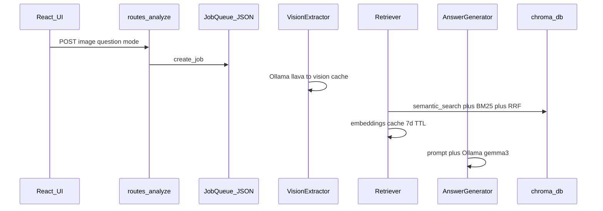

# Urban Tiles Knowledge Base Migration

## Canonical documentation (read before building)

Use **only these two** as source of truth for system behavior:

| Doc | Role |
|-----|------|
| [docs/what_this_project_does.md](docs/what_this_project_does.md) | Onboarding map: directories, request flow, config defaults, known gaps |
| [docs/ARCHITECTURE_v0.3.md](docs/ARCHITECTURE_v0.3.md) | v0.3 design: async jobs, cache layers, shapefile enrichment intent, worker pipeline |

Your update correctly makes `ARCHITECTURE_v0.3.md` the **canonical architecture** link from the onboarding doc. Other files under `docs/` (PROJECT_SUMMARY, SYSTEM_STATUS, DOCUMENTATION_SUMMARY, API.md ingest section) are **artifacts** — ignore unless doing a separate cleanup.

### ARCHITECTURE_v0.3 vs what is actually running today

| Topic | Implemented (trust onboarding doc + code) | ARCHITECTURE_v0.3 describes (design / history) |
|-------|-------------------------------------------|-----------------------------------------------|
| **Models** | `llava:7b` + `gemma3:1b` local Ollama | Qwen 235B problem, cloud `llama2-vision:3b` recommendations |
| **Job queue** | JSON at `cache/metadata/job_queue.json` + filelock | Diagram labels "Redis/DB" |
| **Workers** | 3 asyncio loops in `app/workers/` | Same intent — matches |
| **Retrieval** | `rag_service`: Chroma + BM25 + RRF in [app/workers/retriever.py](app/workers/retriever.py) | Same — matches |
| **Spatial stage** | Job stage exists; retriever marks `spatial_enrichment` done as **no-op** (TODO) | Full shapefile enrichment described as active |
| **KB source today** | `data/knowledge/*.txt` → `chroma_db` (after manual ingest) | Examples cite `settlement_patterns.txt`, Ariana ADM2 |
| **KB target** | **`urban_tiles/`** (your new direction) | Not in v0.3 doc yet — we add via this migration |

**Implication for this migration:** we only swap **what gets ingested into ChromaDB** and fix **setup scripts**. We do **not** redesign the v0.3 async pipeline, workers, or cache architecture.

---

## How this fits the v0.3 runtime (no worker changes)

Production path from [docs/what_this_project_does.md](docs/what_this_project_does.md) §3:



**Retriever worker** ([app/workers/retriever.py](app/workers/retriever.py)) calls `semantic_search`, `keyword_search`, `merge_and_rerank` from [app/services/rag_service.py](app/services/rag_service.py). After urban_tiles ingest:

- Same code path; retrieved `source` values become `urban_tiles/{city}/{tile_id}` instead of `tunisia_adm2_*.txt`
- [app/core/prompt_builder.py](app/core/prompt_builder.py) already cites `chunk.source` in prompts — no change required
- Per [ARCHITECTURE_v0.3.md](docs/ARCHITECTURE_v0.3.md) caching rules: **must clear embedding cache** after KB reset (7-day TTL would otherwise serve stale Tunisia chunks)

**Vision** stays on user upload (Ollama). Tile `.jpg`/`.tif` under `urban_tiles/` are reference assets, not auto-fed to the pipeline.

**Spatial (your decision):** keep Tunisia ADM2 shapefiles for Tunis-area enrichment when wired; global cities use urban_tiles text only. Retriever spatial stage remains no-op until separately implemented.

---

## Target data model

**Source of truth per city:** `urban_tiles/{city}/vectors/all_vectors.json` only — **104 tiles**, **12 cities** (`cairo`, `chicago`, `dubai`, `istanbul`, `manhattan`, `paris`, `sao_paulo`, `singapore`, `sydney`, `tokyo`, `tunis`, `venice`).

- **Do not ingest** `batch_*.json` — embedding pipeline checkpoints; content duplicates `all_vectors.json` (verified for Cairo).
- **City name** = parent folder name (not in JSON).

**Per-tile JSON fields to use:**

- Embed: `text_description` (~1.4–2.6 KB) + prepended header (city, bbox, LULC, urban_features)
- Chroma metadata: `city`, `region_id`, `image_path`, `bbox`, fractions, `building_density`, `road_pattern`
- Store only; not embedded today: `geometry`, `derived_metrics`, Sentinel `metadata`

**Chunking (best for this data):** **one chunk per tile** — avoids breaking the 5-section `text_description` structure; 104-tile corpus is small enough for tile-level retrieval.

**Chroma `source`:** `urban_tiles/{city}/{region_id}` (e.g. `urban_tiles/cairo/tile_0000`).

---

## Implementation plan

### 1. Extend `rag_service` (ingest + reset only)

**File:** [app/services/rag_service.py](app/services/rag_service.py)

- `reset_knowledge_base()` — delete/recreate collection `geo_knowledge`; reset `_collection`, `_bm25_index`, `_bm25_documents`
- Extend `ingest_documents()`:
  - Optional per-doc `metadata` dict → Chroma metadatas
  - `skip_chunking=True` (or threshold ~3 KB) for urban tile documents
  - Keep default 500/100 chunking for any legacy `.txt` if needed later

No changes to `semantic_search`, `keyword_search`, `merge_and_rerank`, or `gis_query`.

### 2. New script: `scripts/ingest_urban_tiles.py`

- Args: `--reset`, `--city cairo`, `--dry-run`
- Load each `urban_tiles/*/vectors/all_vectors.json`
- Build header + `text_description`; validate image file exists (`.tif` or `.jpg`)
- `sys.path` / run from **project root** so `CHROMA_PERSIST_DIR=./chroma_db` matches [docs/what_this_project_does.md](docs/what_this_project_does.md) §14

```bash
python scripts/ingest_urban_tiles.py --reset
```

Expected: **104 chunks** in collection `geo_knowledge`.

### 3. Retire old KB at runtime

- Wipe `chroma_db/` via `--reset` (not the `urban_tiles/` asset tree)
- Do not run `ingest_knowledge.py` / Tunisia `.txt` ingest again
- Clear caches: `POST /api/cache/clear` or delete `cache/embeddings/*` (and `app/cache/embeddings/*` if CWD was `app/`)
- Optional: `data/knowledge/` → `data/knowledge_archive/` to prevent accidental re-ingest

### 4. Fix setup path bugs (called out in canonical onboarding doc §8)

| File | Change |
|------|--------|
| [START.bat](START.bat) | Step 3: `ingest_urban_tiles.py --reset` when no `chroma_db`; run from repo root |
| [scripts/ingest_knowledge.py](scripts/ingest_knowledge.py) | Deprecation → points to `ingest_urban_tiles.py` |
| [scripts/verify_knowledge_base.py](scripts/verify_knowledge_base.py) | Chroma count ≈104; per-city source check; sample `semantic_search` |
| [app/config.py](app/config.py) | `URBAN_TILES_DIR = "./urban_tiles"` |

### 5. Update canonical docs after implementation

**[docs/what_this_project_does.md](docs/what_this_project_does.md):**

- §1 diagram: `chroma_db/` + `urban_tiles/` (not `data/knowledge/*.txt`)
- §8: mark `data/knowledge/` as legacy/archive; primary KB = urban_tiles ingest
- §9: remove "not wired"; document ingest command and schema fields (`text_description`, etc.)
- §12, §15 prerequisites, §18 gap #5, §19 "wrong region" row, Quick Reference mental model

**[docs/ARCHITECTURE_v0.3.md](docs/ARCHITECTURE_v0.3.md):**

- Add short "Knowledge base" subsection: urban_tiles → Chroma via offline ingest; 104 tile records
- Update cache example `source` fields in embedding cache JSON example to `urban_tiles/...`
- Note: spatial enrichment still Tunisia ADM2; global context via RAG text

**Also:** [data/README.md](data/README.md) — KB pointer to `urban_tiles/`

### 6. Tests

- [tests/test_integration.py](tests/test_integration.py), [tests/test_end2end_realimages.py](tests/test_end2end_realimages.py): fixture ingest 1–2 urban tile docs instead of Tunisia `.txt`
- [tests/test_rag.py](tests/test_rag.py): add case for `skip_chunking` if exposed

---

## Verification checklist

1. `python scripts/ingest_urban_tiles.py --reset` → 104 chunks, 12 cities
2. `python scripts/verify_knowledge_base.py` → pass
3. `semantic_search("high built-up organic roads cairo")` → sources under `urban_tiles/cairo/`
4. Backend from project root: `python -m uvicorn app.main:app --port 8000`
5. UI test: upload `urban_tiles/cairo/tile_0000.jpg`, ask about land cover → `retrieved_context` cites `urban_tiles/cairo/tile_*`
6. `POST /api/cache/clear` then repeat query — no stale Tunisia chunks
7. `GET /api/spatial/status` — Tunisia shapefiles still load (unchanged)

---

## Risks and mitigations

| Risk | Mitigation |
|------|------------|
| Duplicate Chroma if ingest without `--reset` | Require `--reset` on first migration |
| `chroma_db/` at wrong path (CWD `app/` vs root) | Ingest + uvicorn from project root; fix START.bat |
| Stale embedding cache (v0.3 7-day TTL) | Clear cache after KB reset |
| Upload image ≠ KB tile | By design: vision = upload; RAG = question semantics |
| ARCHITECTURE_v0.3 cloud model names confuse future devs | Canonical docs updated post-migration; code = `config.py` |

---

## Out of scope (later)

- Wire `SpatialEnricher` into retriever worker (ARCHITECTURE_v0.3 intent, onboarding doc gap #1)
- Bbox / EXIF tile matching for uploads
- Image embeddings over `.tif`
- `POST /api/rag/ingest` (documented in non-canonical API.md only)
- Fix `llm_only` mode in async workers (onboarding doc gap #2)
